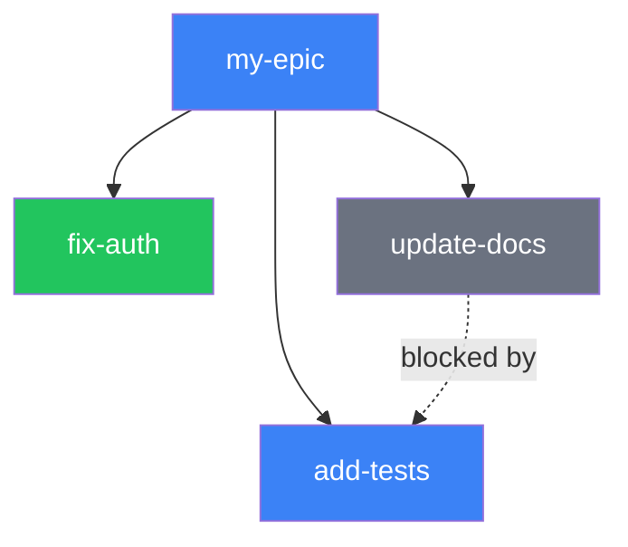

# GitHub Copilot Instructions

This repository uses the **Weave** graph-based workflow system. **Every code change must follow
this workflow. No exceptions.** Enforcement is layered:

1. **VS Code hooks** (`chat.hooks.enabled: true`) -- PreToolUse hooks fire before every tool call,
   blocking edits when no active Weave node exists (deterministic, exit 2)
2. **MCP edit guard** -- `weave_edit_guard` returns an error if no active node (advisory but visible)
3. **Git pre-commit hook** -- blocks commits without an active node (last-resort safety net)

## Session Start (MANDATORY)

Run these before doing any work:

```bash
wv status                    # Check active/ready/blocked counts
wv learnings                 # Review captured patterns and pitfalls
wv ready                     # Find unblocked work
wv guide                     # Workflow quick reference (topics: workflow, github, learnings, context)
```

Or via MCP: call `weave_overview` which returns status + health + ready work in one call. Use
`weave_guide` (topic: workflow|github|learnings|context) for a workflow reference without leaving
your client.

## Before Every Task

```bash
wv work <id>                 # Claim an existing task, OR:
wv add "<description>" --gh --alias=<short-name>  # Create new node + GitHub issue
wv context <id> --json       # Understand dependencies and blockers
wv plan <file> --sprint=N --gh  # Import markdown plan as epic + tasks with GH issues
```

**Rules:**

- Always use `--gh` when creating nodes -- every task needs a GitHub issue
- Always use `--alias=<name>` -- short names make the graph readable
- Always run `wv context <id> --json` before complex work
- Check learnings with `wv learnings --grep="<topic>"` for relevant prior decisions
- For epics: use `wv plan <file> --sprint=N --gh` to import structured plans

## BEFORE ANY FILE EDIT (mandatory gate)

**Call `weave_edit_guard` (MCP) before every file modification.** This is the enforcement gate that
ensures graph-first workflow. It returns an error if no active Weave node exists.

If `weave_edit_guard` returns an error:
1. STOP — do not edit any files
2. Run `weave_overview` to see available work
3. Claim work with `wv work <id>` or `wv add "<description>" --gh --status=active`
4. Re-call `weave_edit_guard` to confirm — it should return OK
5. Only then proceed with the file edit

**Why this matters:** Without this gate, edits happen outside the graph and the audit trail is
broken. The git pre-commit hook catches this at commit time, but by then the work is already done
without tracking. This gate catches it at edit time.

## During Work

- One active node at a time
- Commit incrementally after each logical unit -- don't accumulate
- Store commit hashes in node metadata:
  `wv update <id> --metadata='{"commit":"<hash>"}'`
- Save session breadcrumbs between tasks:
  `wv breadcrumbs save --msg="<what was done, what's next>"`
- View epic progress: `wv tree --active`

## Mermaid Graphs (REQUIRED for epics and features)

When working on epics or multi-task features, generate Mermaid dependency/progress graphs to
visualize the work. This is what makes Weave a graph system, not a flat checklist.

**When to generate:**

- At epic creation: show the full dependency structure
- During work: show progress (done/active/blocked status)
- At epic completion: show the final state

**How to build from `wv tree --json`:**

1. Call `wv tree --json` (or MCP `weave_tree`) to get the hierarchy
2. Build a Mermaid flowchart from the JSON:
   - Use aliases as node labels (fall back to truncated text)
   - Color by status: done=green, active=blue, blocked=red, todo=gray
   - Show implements/blocks edges from the tree structure

**Example pattern:**



If your client supports `renderMermaidDiagram`, use it to display the graph inline.
If not, include the Mermaid markup in a fenced code block in breadcrumbs or commit messages.

## Completing Work

```bash
wv done <id> --learning="<decision/pattern/pitfall>"
```

Always capture a learning. Include what worked, what didn't, or what future sessions should know.

## Session End (MANDATORY)

```bash
wv sync --gh && git push     # Sync graph + GitHub issues, then push
```

**Not** `wv sync` -- the `--gh` flag syncs GitHub issues. Without it, nodes created with `--gh`
won't have their status reflected on GitHub.

## MCP Tools (23 total)

If your client supports MCP, prefer compound tools over CLI for multi-step operations:

<!-- markdownlint-disable MD060 -->

| Tool               | Equivalent CLI                         | Use for              |
| ------------------ | -------------------------------------- | -------------------- |
| `weave_overview`   | `wv status` + `wv health` + `wv ready` | Session start        |
| `weave_work`       | `wv work <id>` + `wv context <id>`     | Claiming tasks       |
| `weave_ship`       | `wv ship <id>`                         | Completing tasks     |
| `weave_edit_guard` | (no CLI equivalent)                    | **Pre-edit gate**    |
| `weave_preflight`  | `wv preflight <id>`                    | Pre-action checks    |
| `weave_quick`      | `wv add` + `wv done` + `wv sync`       | Trivial one-step     |
| `weave_tree`       | `wv tree --json`                       | Epic hierarchy       |
| `weave_learnings`  | `wv learnings --json`                  | Check prior work     |
| `weave_plan`       | `wv plan <file> --sprint=N`            | Import plan          |
| `weave_breadcrumbs`| `wv breadcrumbs save/show/clear`       | Session handoff      |
| `weave_update`     | `wv update <id> --metadata=...`        | Enrich nodes         |
| `weave_guide`      | `wv guide --topic=<topic>`             | Workflow quick ref   |

Other tools: `weave_add`, `weave_done`, `weave_batch_done`, `weave_link`, `weave_list`,
`weave_context`, `weave_search`, `weave_status`, `weave_health`, `weave_sync`, `weave_resolve`,
`weave_close_session`.

For CLI operations via terminal: `wv` works -- but the workflow steps above are still mandatory.

## Command Reference

| Command                   | Usage                                   | Key Flags                                  |
| ------------------------- | --------------------------------------- | ------------------------------------------ |
| `wv ready`                | List unblocked tasks                    | `--json`, `--count`                        |
| `wv add <text>`           | Create node (returns wv-xxxxxx ID)        | `--gh`, `--alias=`, `--status=`            |
| `wv work <id>`            | Claim task (sets active)                | Exports WV_ACTIVE for subagents            |
| `wv done <id>`            | Complete task                           | `--learning="..."` (always include)        |
| `wv ship <id>`            | Done + sync + push in one step          | `--learning="..."`                         |
| `wv update <id>`          | Modify node                             | `--status=`, `--text=`, `--metadata=`      |
| `wv show <id>`            | Node details                            | `--json`                                   |
| `wv list`                 | Non-done nodes                          | `--all`, `--status=`, `--json`             |
| `wv tree`                 | Epic hierarchy                          | `--active`, `--depth=N`, `--json`          |
| `wv link <from> <to>`     | Create edge between nodes               | `--type=implements\|blocks\|related`       |
| `wv block <id> --by=<id>` | Add dependency                          | Sets target to blocked                     |
| `wv context <id>`         | Full context pack                       | `--json` (cached per session)              |
| `wv learnings`            | View captured patterns/decisions        | `--grep=`, `--recent=N`, `--category=`     |
| `wv search <query>`       | Full-text search                        | `--json`                                   |
| `wv plan <file>`          | Import markdown as epic + tasks         | `--sprint=N`, `--gh`, `--dry-run`          |
| `wv breadcrumbs`          | Session context notes                   | `save --msg=`, `show`, `clear`             |
| `wv health`               | System health check                     | `--json`, `--verbose`                      |
| `wv status`               | Compact status summary                  |                                            |
| `wv sync`                 | Persist graph to disk                   | `--gh` (sync GitHub issues)                |
| `wv prune`                | Archive old done nodes                  | `--age=`, `--dry-run`                      |

## Common Pitfalls

1. **Forgetting `--gh`** -- Creates orphan nodes with no GitHub issue
2. **Skipping learnings** -- Repeating mistakes that prior sessions already documented
3. **`wv sync` without `--gh`** -- GitHub issues don't get updated
4. **Orphan nodes** -- Run `wv health` to detect. Fix with
   `wv link <orphan> <epic> --type=implements` or `wv prune` for junk
5. **No aliases** -- Makes the graph unreadable. Always `--alias=<short-name>`
6. **Not checking learnings** -- Run `wv learnings --grep="<topic>"` before starting work
