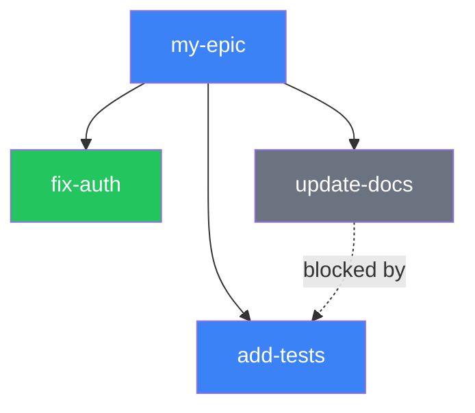

# GitHub Copilot Instructions

> **This is the memory-system development reference** — the full workflow is appropriate here
> because this repo IS Weave. For the minimal template used in target repos, see
> `templates/copilot-instructions.stub.md`.

This repository uses the **Weave** graph-based workflow system. **Every code change must follow this
workflow. No exceptions.** Enforcement is layered:

1. **MCP edit guard** -- `weave_edit_guard` returns an error if no active node (advisory; agent must
   invoke explicitly before every edit -- there is no automatic pre-edit hard block in VS Code)
2. **Git pre-commit hook** -- blocks commits without an active node (deterministic, last-resort
   safety net)

> **Enforcement model (v1.17.0):** All agents (`claude` CLI, `@copilot`, `@claude`) read hooks from
> `~/.claude/settings.json`. VS Code ignores matchers — hooks fire on every tool invocation. The
> scripts handle both Claude Code tool names (`Edit`/`Write`) and VS Code tool names
> (`create_file`/`replace_string_in_file`), including camelCase `tool_input` properties
> (`filePath`). The MCP `weave_edit_guard` provides an additional advisory gate; the git pre-commit
> hook is the last-resort safety net.

## Session Start (MANDATORY)

Run these before doing any work:

```bash
wv status                    # Check active/ready/blocked counts
wv learnings                 # Review captured patterns and pitfalls
wv ready                     # Find unblocked work
wv guide                     # Workflow quick reference (topics: workflow, github, learnings, context)
```

Or via MCP: call `weave_overview` which returns status + health + ready work in one call. Use
`weave_guide` (topic: workflow|github|learnings|context) for a workflow reference without leaving
your client.

## Before Every Task

```bash
wv work <id>                 # Claim an existing task, OR:
wv add "<description>" --gh --alias=<short-name>  # Create new node + GitHub issue
wv context <id> --json       # Understand dependencies and blockers
wv plan <file> --sprint=N --gh  # Import markdown plan as epic + tasks with GH issues
```

**Rules:**

- Always use `--gh` when creating nodes -- every task needs a GitHub issue
- Always use `--alias=<name>` -- short names make the graph readable
- Always run `wv context <id> --json` before complex work
- Check learnings with `wv learnings --grep="<topic>"` for relevant prior decisions
- For epics: use `wv plan <file> --sprint=N --gh` to import structured plans

## BEFORE ANY FILE EDIT (mandatory gate)

**Call `weave_edit_guard` (MCP) before every file modification.** This is the enforcement gate that
ensures graph-first workflow. It returns an error if no active Weave node exists.

If `weave_edit_guard` returns an error:

1. STOP — do not edit any files
2. Run `weave_overview` to see available work
3. Claim work with `wv work <id>` or `wv add "<description>" --gh --status=active`
4. Re-call `weave_edit_guard` to confirm — it should return OK
5. Only then proceed with the file edit

**Why this matters:** Without this gate, edits happen outside the graph and the audit trail is
broken. The git pre-commit hook catches this at commit time, but by then the work is already done
without tracking. This gate catches it at edit time.

## During Work

- One active node at a time
- Commit incrementally after each logical unit -- don't accumulate
- Store commit hashes in node metadata: `wv update <id> --metadata='{"commit":"<hash>"}'`
- Save session breadcrumbs between tasks: `wv breadcrumbs save --msg="<what was done, what's next>"`
- View epic progress: `wv tree --active`

## Mermaid Graphs (REQUIRED for epics and features)

When working on epics or multi-task features, generate Mermaid dependency/progress graphs to
visualize the work. This is what makes Weave a graph system, not a flat checklist.

**When to generate:**

- At epic creation: show the full dependency structure
- During work: show progress (done/active/blocked status)
- At epic completion: show the final state

**How to build from `wv tree --json`:**

1. Call `wv tree --json` (or MCP `weave_tree`) to get the hierarchy
2. Build a Mermaid flowchart from the JSON:
   - Use aliases as node labels (fall back to truncated text)
   - Color by status: done=green, active=blue, blocked=red, todo=gray
   - Show implements/blocks edges from the tree structure

**Example pattern:**


```mermaid
graph TD
    classDef done fill:#22c55e,color:#fff
    classDef active fill:#3b82f6,color:#fff
    classDef blocked fill:#ef4444,color:#fff
    classDef todo fill:#6b7280,color:#fff

    epic[my-epic]:::active
    task1[fix-auth]:::done
    task2[add-tests]:::active
    task3[update-docs]:::todo

    epic --> task1
    epic --> task2
    epic --> task3
    task3 -.->|blocked by| task2
```

If your client supports `renderMermaidDiagram`, use it to display the graph inline. If not, include
the Mermaid markup in a fenced code block in breadcrumbs or commit messages.

## Completing Work

```bash
wv done <id> --learning="<decision/pattern/pitfall>" --no-overlap-check
```

Always capture a learning. Include what worked, what didn't, or what future sessions should know.

`--no-overlap-check` skips the interactive learning-similarity prompt — use it in agent and script
contexts where stdin is not available. In human sessions you can omit it to see overlap advisories.

## Session End (MANDATORY)

```bash
wv sync --gh && git add .weave/   # Sync graph + GitHub issues (may dirty .weave/)
git diff --cached --quiet || git commit -m "chore(weave): sync state [skip ci]"
git push
```

**Not** `wv sync` -- the `--gh` flag syncs GitHub issues. Without it, nodes created with `--gh`
won't have their status reflected on GitHub.

## MCP Tools (31 total)

**Two MCP server instances** are configured in `.vscode/mcp.json`: `weave` (all 31 tools) and
`weave-inspect` (14 read-only tools). Restart via Command Palette → **MCP: Restart Server** after
any `npm run build` in `mcp/`.

> **Claude Code does not use MCP.** Claude Code (`claude` CLI, `@claude` in VS Code) interacts with
> Weave exclusively via `wv` CLI commands in the terminal and enforcement hooks in
> `~/.claude/settings.json`. The MCP servers in `.vscode/mcp.json` are only consumed by Copilot Chat
> (`@copilot`). Do not add MCP-specific instructions to `CLAUDE.md` or `AGENTS.md`.

If your client supports MCP, prefer compound tools over CLI for multi-step operations:

<!-- markdownlint-disable MD060 -->

| Tool                | Equivalent CLI                         | Use for            |
| ------------------- | -------------------------------------- | ------------------ |
| `weave_overview`    | `wv status` + `wv health` + `wv ready` | Session start      |
| `weave_work`        | `wv work <id>` + `wv context <id>`     | Claiming tasks     |
| `weave_ship`        | `wv ship <id>`                         | Completing tasks   |
| `weave_edit_guard`  | (no CLI equivalent)                    | **Pre-edit gate**  |
| `weave_preflight`   | `wv preflight <id>`                    | Pre-action checks  |
| `weave_quick`       | `wv add` + `wv done` + `wv sync`       | Trivial one-step   |
| `weave_tree`        | `wv tree --json`                       | Epic hierarchy     |
| `weave_learnings`   | `wv learnings --json`                  | Check prior work   |
| `weave_plan`        | `wv plan <file> --sprint=N`            | Import plan        |
| `weave_breadcrumbs` | `wv breadcrumbs save/show/clear`       | Session handoff    |
| `weave_update`      | `wv update <id> --metadata=...`        | Enrich nodes       |
| `weave_guide`       | `wv guide --topic=<topic>`             | Workflow quick ref |

Other tools: `weave_add`, `weave_done`, `weave_batch_done`, `weave_link`, `weave_list`,
`weave_context`, `weave_search`, `weave_status`, `weave_health`, `weave_sync`, `weave_resolve`,
`weave_close_session`, `weave_recover`, `weave_delete`, `weave_show`, `weave_update`,
`weave_quality_scan`, `weave_quality_hotspots`, `weave_quality_diff`, `weave_quality_functions`.

For CLI operations via terminal: `wv` works -- but the workflow steps above are still mandatory.

## Command Reference

| Command                   | Usage                              | Key Flags                                       |
| ------------------------- | ---------------------------------- | ----------------------------------------------- |
| `wv ready`                | List unblocked tasks               | `--json`, `--count`                             |
| `wv add <text>`           | Create node (returns wv-xxxxxx ID) | `--gh`, `--alias=`, `--status=`, `--standalone` |
| `wv work <id>`            | Claim task (sets active)           | Exports WV_ACTIVE for subagents                 |
| `wv done <id>`            | Complete task                      | `--learning="..."`, `--no-overlap-check`        |
| `wv ship <id>`            | Done + sync + push in one step     | `--learning="..."`, `--no-overlap-check`        |
| `wv update <id>`          | Modify node                        | `--status=`, `--text=`, `--metadata=`           |
| `wv show <id>`            | Node details                       | `--json`                                        |
| `wv list`                 | Non-done nodes                     | `--all`, `--status=`, `--json`                  |
| `wv tree`                 | Epic hierarchy                     | `--active`, `--depth=N`, `--json`               |
| `wv link <from> <to>`     | Create edge between nodes          | `--type=implements\|blocks\|related`            |
| `wv block <id> --by=<id>` | Add dependency                     | Sets target to blocked                          |
| `wv context <id>`         | Full context pack                  | `--json` (cached per session)                   |
| `wv learnings`            | View captured patterns/decisions   | `--grep=`, `--recent=N`, `--category=`          |
| `wv search <query>`       | Full-text search                   | `--json`                                        |
| `wv plan <file>`          | Import markdown as epic + tasks    | `--sprint=N`, `--gh`, `--dry-run`               |
| `wv breadcrumbs`          | Session context notes              | `save --msg=`, `show`, `clear`                  |
| `wv health`               | System health check                | `--json`, `--verbose`                           |
| `wv status`               | Compact status summary             |                                                 |
| `wv sync`                 | Persist graph to disk              | `--gh` (sync GitHub issues)                     |
| `wv prune`                | Archive old done nodes             | `--age=`, `--orphans-only`, `--dry-run`         |

## Common Pitfalls

1. **Forgetting `--gh`** -- Creates orphan nodes with no GitHub issue
2. **Skipping learnings** -- Repeating mistakes that prior sessions already documented
3. **`wv sync` without `--gh`** -- GitHub issues don't get updated
4. **Orphan nodes** -- Run `wv health` to detect. Classify before acting:
   - Test/garbage → `wv delete <id>`
   - Real work with no parent → `wv link <orphan> <epic> --type=implements`
   - Legitimate standalones (releases, chores) → `wv prune --orphans-only`
   - Note: `wv prune --age=Nd` misses nodes touched by `wv sync --gh` today — use `--orphans-only`
     after any bulk sync that closed many nodes
5. **No aliases** -- Makes the graph unreadable. Always `--alias=<short-name>`
6. **Not checking learnings** -- Run `wv learnings --grep="<topic>"` before starting work
